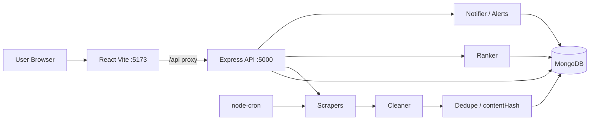
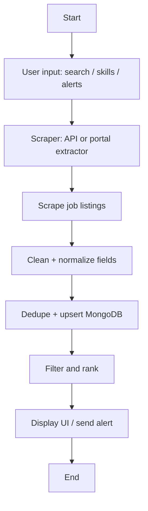
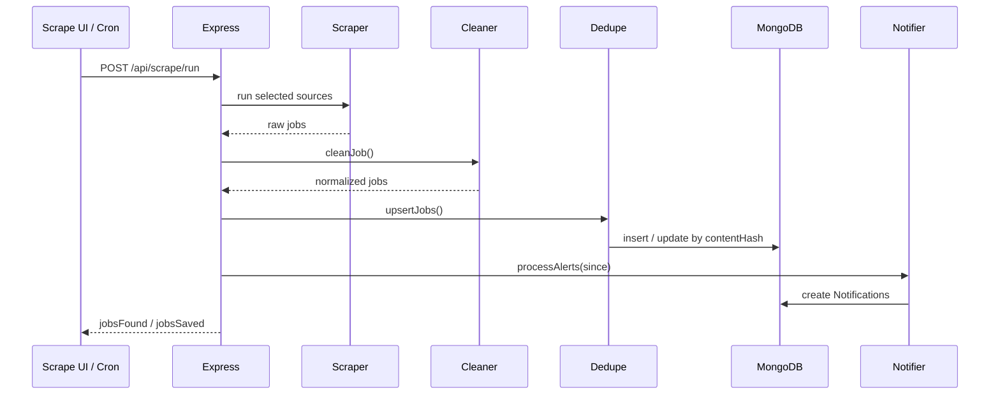
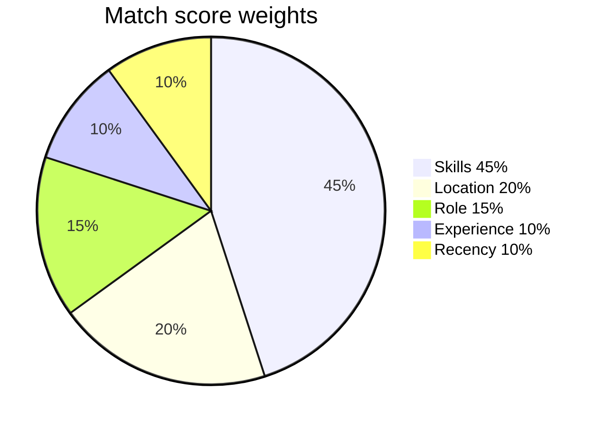

# System architecture & methodology (Phase 10)

Copy these diagrams into your report or PPT (GitHub, VS Code, or [mermaid.live](https://mermaid.live) can render them).

---

## 1. High-level architecture



---

## 2. Methodology (Phase-01 style)



---

## 3. Scraping pipeline detail



---

## 4. Recommendation scoring



---

## 5. Folder map (implementation)

```
inteligent_job_aggregation/
├── backend/
│   ├── server.js
│   ├── src/
│   │   ├── models/          User, Job, ScrapeLog, Alert, Notification
│   │   ├── scrapers/        remotive, remoteok, portals, cheerio, puppeteer
│   │   ├── services/        cleaner, dedupe, ranker, notifier, resumeParser
│   │   ├── routes/          auth, users, jobs, scrape, alerts
│   │   ├── jobs/cron.js     scheduler
│   │   └── scripts/         seed, import, demo fallback, verify
│   ├── tests/               unit tests (Phase 8)
│   └── sample-data/         jobs.json + portal fixtures
├── frontend/
│   └── src/pages/           Home, Jobs, Profile, Scrape, Alerts, Recommendations...
├── REPORT.md                report text (Phase 9)
├── PPT_NOTES.md             viva slides (Phase 9)
├── DEMO_CHECKLIST.md        live demo (Phase 8)
├── ARCHITECTURE.md          this file (Phase 10)
└── SUBMISSION.md            handoff checklist (Phase 10)
```

---

## 6. Tech stack summary (for SRS table)

| Layer | Choice |
|---|---|
| Presentation | React + Vite |
| Application | Node.js + Express |
| Data | MongoDB + Mongoose |
| Scraping | Cheerio, Puppeteer, public job APIs |
| Auth | JWT + bcrypt |
| Scheduling | node-cron |
| Alerts | In-app notifications (+ optional SMTP) |
